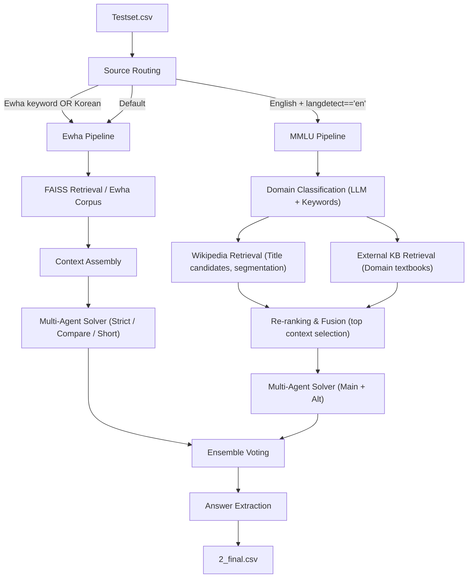
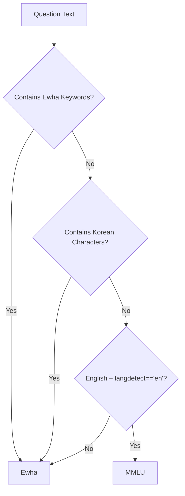

# Ewha Regulations + MMLU-Pro Hybrid RAG Pipeline  
Team 2 – NLP Term Project, Ewha Womans University  
Minsol Kim, Eunsu Jung, Songhee Han, Yewon Heo

A hybrid Retrieval-Augmented Generation (RAG) system integrating **Ewha academic regulations** and **MMLU-Pro reasoning tasks**, using FAISS retrieval, Wikipedia expansion, domain-aware knowledge bases, and multi-agent LLM inference.

This repository contains the complete pipeline from offline corpus construction to online inference and evaluation.

---

## GitHub Topics  
rag, faiss, nlp, llm, retrieval-augmented-generation, mmlu, wikipedia, solar-pro

---

## 1. Project Overview

### Input  
`testset.csv`  
(QID, question text, answer choices)

### Output  
`2_final.csv`  
(QID, predicted answer formatted as `(X)`)

### End-to-End Pipeline  
1. Source routing (Ewha vs MMLU)  
2. MMLU domain classification  
3. Retrieval-Augmented Generation  
   - Ewha regulation corpus (FAISS)  
   - Wikipedia-based expansion  
   - External domain-specific Knowledge Base  
4. Multi-agent LLM reasoning  
5. Ensemble voting  
6. CSV output generation

---

## 2. Repository Structure

```
rag-mmlu-ewha/
│
├── data/
│   ├── ewha_corpus_final.jsonl
│   ├── ewha_index_final.faiss
│   ├── mmlu_kb.jsonl
│   ├── mmlu_kb_index.faiss
│   └── testset.csv
│
├── src/
│   ├── parsing/
│   │   └── parse_testset.py
│
│   ├── routing/
│   │   └── router.py
│
│   ├── retrieval/
│   │   ├── embeddings.py
│   │   ├── vector_store.py
│   │   └── retriever.py
│
│   ├── llm/
│   │   ├── solver.py
│   │   ├── prompts_ewha.py
│   │   └── prompts_mmlu.py
│
│   └── utils/
│
├── run.py
├── evaluate_testset.py
└── README.md
```

---

## 3. Pipeline Architecture (Mermaid Diagram)

### End-to-End Pipeline Overview



---

## 4. Offline Preparation

### Ewha Corpus  
The Ewha regulation PDF was parsed, normalized, and restructured:  
- Removal of noise, HTML fragments, redundant markers  
- Sentence canonicalization  
- Separation of appendices and supplementary rules  

Embedded using `solar-embedding-1-large` → stored in FAISS index.

### External Knowledge Base (MMLU Domains)  
Domain-specific authoritative materials were collected:

- Law: MIT OCW Legal materials, UNC Law booklet  
- Psychology: OpenStax Psychology  
- Business: OpenStax Economics, Marketing  
- Philosophy: IEP, OpenStax Philosophy  
- History: OpenStax World History  

Chunked and embedded into FAISS for retrieval.

---

## 5. Source Routing

Source routing determines whether the model should use Ewha regulations or MMLU resources.

### Routing Rules  
1. Ewha-related keyword detected → Ewha  
2. Korean characters detected → Ewha  
3. English present + `langdetect == "en"` → MMLU  
4. Default → Ewha

This yields perfect routing accuracy for Ewha questions.

---

### Routing Decision Diagram



---

## 6. Domain Classification (MMLU Only)

Domains: law, psychology, business, philosophy, history

### Two-stage classification  
1. Few-shot LLM-based classifier  
2. Keyword scoring fallback  
Default domain: history

---

### Domain Classification Diagram


---

## 7. Retrieval-Augmented Generation (RAG)

### Ewha Retrieval  
- Query from question + answer choices  
- FAISS search over Ewha regulation corpus  
- Extraction of top relevant sentences

### MMLU Retrieval  
Hybrid retrieval pipeline:

1. Wikipedia retrieval  
   - Title candidate extraction using n-grams  
   - Page segmentation into semantic chunks  

2. External KB retrieval  
   - Domain textbooks and definitions  

3. Re-ranking  
   - Embedding similarity scoring  
   - Fusion of Wikipedia + KB evidence  

Final context is high-quality mixed evidence.

---

## 8. Multi-Agent LLM Solver

### Ewha Agents  
- Strict agent: logical consistency with regulations  
- Compare agent: option-to-option contrast  
- Short agent: concise reasoning variant

### MMLU Agents  
- Main agent: domain expert  
- Alternative agent: student-like reasoning  

### Ensemble  
Independent predictions are aggregated via majority voting.  
A robust parser extracts the final choice in standardized format.

---

## 9. Evaluation

The evaluation script reports:

- Overall accuracy  
- Ewha vs MMLU performance  
- Domain-level MMLU accuracy  
- Failed examples with snippets

### Final Performance  
- Overall accuracy: 90.00%  
- Ewha accuracy: 100.00%  
- MMLU accuracy: 80.00%

### Domain-Level Accuracy  
- History: 85.71%  
- Psychology: 83.33%  
- Philosophy: 80.00%  
- Business: 100.00%  
- Law: 60.00%

Errors mainly arise from nuanced conceptual differences or incomplete retrieval coverage.

---

## 10. How to Run

### Install dependencies  
```
pip install -r requirements.txt
```

### Generate predictions  
```
python run.py
```
Output: `2_final.csv`

### Evaluate  
```
python evaluate_testset.py
```

---

## 11. Contributions

### Yewon Heo  
- Online pipeline design and implementation  
- Retrieval–inference integration  
- Performance tuning and debugging  
- GitHub repository management  
- Documentation updates (README.md)

### Minsol Kim  
- Offline pipeline design and implementation 
- Performance experiments
- Prompt tuning

### Eunsu Jung  
- Base code implementation  
- External KB construction  
- Prompt tuning  
- Presentation content  

### Songhee Han  
- Base code implementation  
- External KB construction  
- PPT Slide creation  

---

## 12. Conclusion

This project presents a hybrid RAG system integrating:

- FAISS-based semantic retrieval  
- Domain-aware Wikipedia and textbook knowledge  
- Multi-agent LLM structured reasoning  
- Robust routing and domain classification  

The system achieves strong performance on both Ewha-specific questions and MMLU-Pro reasoning tasks, demonstrating the effectiveness of hybrid retrieval and multi-agent inference in multiple-choice question answering.

